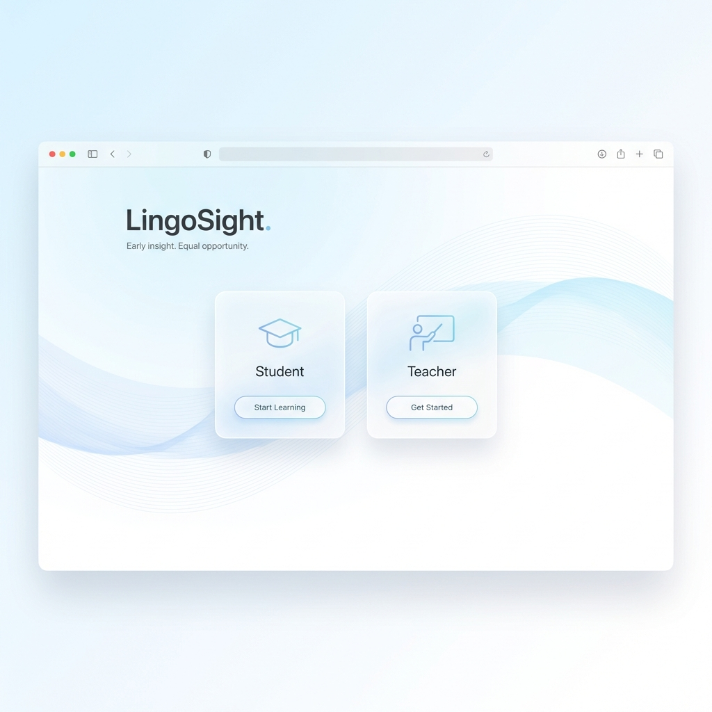
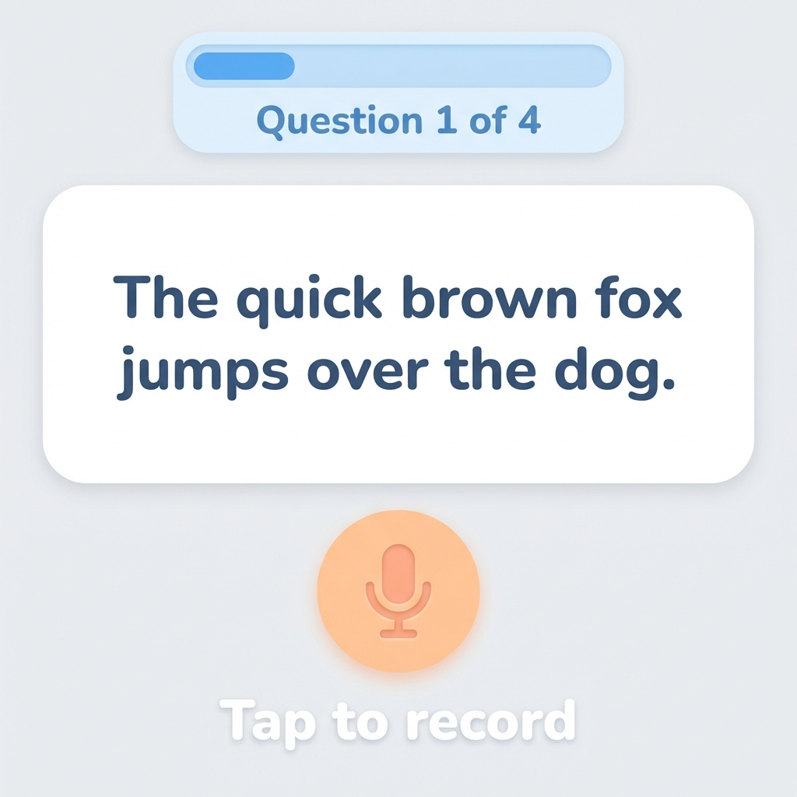
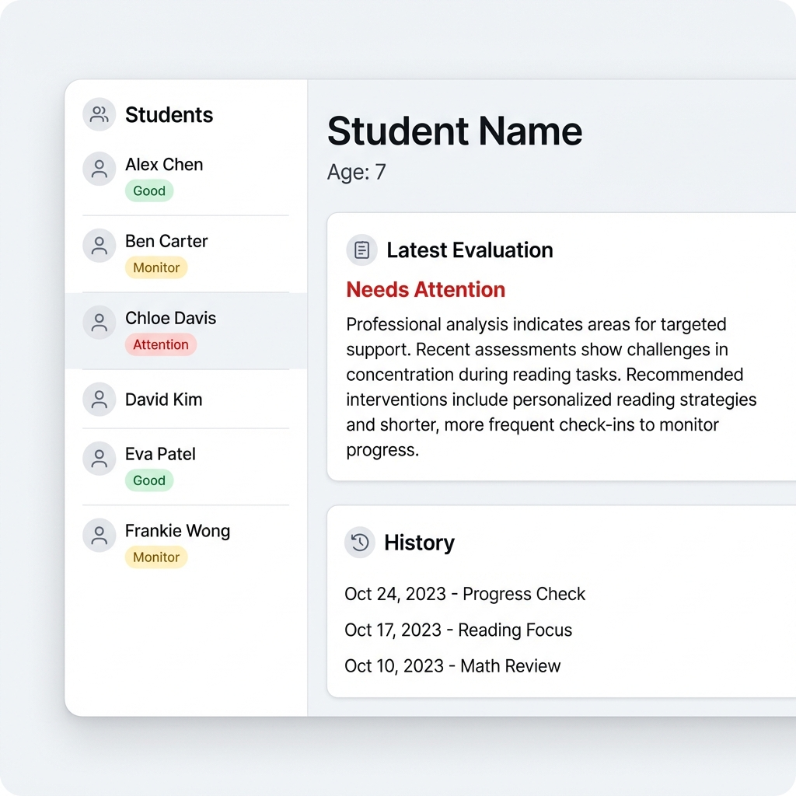

# LingoSight

**Early insight. Equal opportunity.**

LingoSight is an AI-powered screening tool designed to detect early signs of **Dyslexia** and **ADHD** in children through gamified interactive assessments. It combines language processing, speech analysis, and behavioral monitoring to provide educators and parents with actionable insights.



## 🚀 Features

*   **Gamified Assessment**: Interactive reading and answering tasks designed for children (Ages 5-10).
*   **Multi-Modal Analysis**:
    *   **Text Analysis**: Evaluates reading comprehension and writing patterns for Dyslexia indicators.
    *   **Audio Analysis**: Analyzes speech rate, pauses, and speech patterns for ADHD risk factors.
*   **Mental Health Check-in**: An empathetic AI chatbot that screens for signs of anxiety and depression in a safe, conversational space.
*   **Teacher Dashboard**: A comprehensive portal for educators to track student progress and view detailed risk assessments.

| Assessment UI | Teacher Dashboard |
| :---: | :---: |
|  |  |

---

## 🛠 Project Structure

The project may seem complex, but it's organized into three distinct components:

1.  **`frontend/`**: The user interface (HTML/CSS/JS).
2.  **`backend/`**: The main API orchestrator (FastAPI, Port 8000).
3.  **`ai_service/`**: dedicated AI model server (FastAPI, Port 8001).

---

## ⚡ Quick Start Guide

### Prerequisites
*   Python 3.8+
*   Node.js (Optional, only if you expand to React/Vue later)

### Installation
1.  Clone the repository.
2.  Install dependencies:
    ```bash
    pip install -r backend/requirements.txt
    pip install -r ai_service/requirements.txt
    ```

### Running the App
We have provided one-click scripts for Windows:

1.  **Step 1: Start AI Service**
    *   Double-click `run_ai_service.bat`
    *   *Wait for "Application startup complete"*

2.  **Step 2: Start Backend**
    *   Double-click `run_backend.bat`

3.  **Step 3: Start Frontend**
    *   Double-click `run_frontend.bat`
    *   The app will open at `http://localhost:3000`

---

## ⚠️ Large Files (Git)
This repository includes a `.gitignore` that excludes heavy AI models to allow for easy pushing to GitHub.
If you need the models, please run the download script provided in `ai_service` or download them from HuggingFace directly.

---
*Built for Hackathon 2026*
